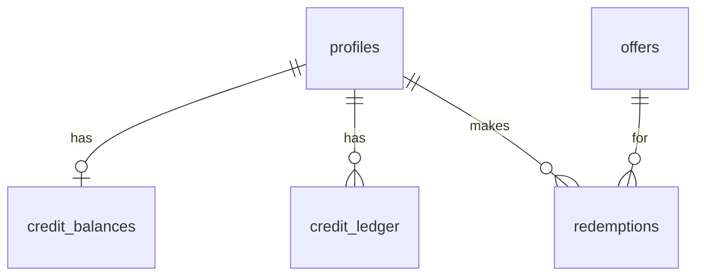

# Huntington Select — MVP Supabase Schema Plan

This document defines the **minimum database tables** for the Huntington Select MVP in Supabase (PostgreSQL). It describes purpose, columns, and relationships only. It does not include SQL migrations or application code.

For how these tables fit into pages, credits, Stripe, and email, see [project-architecture.md](./project-architecture.md).

---

## Overview

| Table | Role in MVP |
|-------|-------------|
| `profiles` | App identity and role (`member` / `admin`) tied to Supabase Auth |
| `offers` | Catalog of benefits members can redeem with credits |
| `credit_balances` | Current credit total per member |
| `credit_ledger` | Append-only audit trail for every credit change |
| `redemptions` | Record of each time a member spends credits on an offer |

**Relationship sketch**

Supabase **Auth** owns sign-in; each `profiles.id` should match the corresponding `auth.users.id`. **Row Level Security (RLS)** will be applied when SQL is written: members see only their own balance, ledger, and redemptions; offers are readable by authenticated members; admin-only writes for offers and sensitive adjustments.

---

## 1. `profiles`

### Purpose

Stores application-specific data for each signed-in user. Supabase Auth handles passwords and sessions; `profiles` holds the email copy used in the app UI, the **role** used for member vs admin access, and when the account was created. New users should get a profile row when they sign up (via trigger or server logic during implementation).

### Columns

| Column | Description |
|--------|-------------|
| `id` | Primary key; same UUID as `auth.users.id` |
| `email` | User email (aligned with auth; useful for display and admin lists) |
| `role` | Access level for MVP: `member` or `admin` |
| `created_at` | When the profile row was created |

### Relationships

- **One-to-one** with Supabase `auth.users` (same `id`).
- **One-to-one** with `credit_balances` (`credit_balances.user_id` → `profiles.id`).
- **One-to-many** with `credit_ledger` (`credit_ledger.user_id` → `profiles.id`).
- **One-to-many** with `redemptions` (`redemptions.user_id` → `profiles.id`).

---

## 2. `offers`

### Purpose

Defines what members can redeem with credits (dining, events, services, partner perks, etc.). Admins create and maintain offers; members browse active offers and spend credits at redemption time. `category` groups offers in the catalog; `status` controls whether an offer is visible or redeemable (exact status values to be chosen at implementation, e.g. `draft`, `active`, `archived`).

### Columns

| Column | Description |
|--------|-------------|
| `id` | Primary key |
| `title` | Short name shown in lists and emails |
| `description` | Full details on the offer detail page |
| `category` | Grouping label for browsing (e.g. dining, events) |
| `credits_required` | How many credits a single redemption costs |
| `status` | Lifecycle state (publish/unpublish for MVP admin flows) |
| `created_at` | When the offer was created |

### Relationships

- **One-to-many** with `redemptions` (`redemptions.offer_id` → `offers.id`).
- No direct FK to `profiles` (offers are global catalog rows; admins edit them via elevated access).

---

## 3. `credit_balances`

### Purpose

Holds each member’s **current** credit total for fast reads on the dashboard and before redemption. Every change to `balance` should also append a row to `credit_ledger` so history stays trustworthy (see [project-architecture.md](./project-architecture.md) credit rules).

### Columns

| Column | Description |
|--------|-------------|
| `user_id` | Primary key; identifies the member (`profiles.id`) |
| `balance` | Integer count of credits available (MVP: non-negative) |

### Relationships

- **Many-to-one** with `profiles` (`user_id` → `profiles.id`); one balance row per member in MVP.

---

## 4. `credit_ledger`

### Purpose

Append-only **audit trail** for all credit movements: Stripe purchases, redemptions, admin adjustments, etc. The `type` field categorizes the event; `description` gives human-readable context for the member history page and support. Amount is signed: positive adds credits, negative spends them.

### Columns

| Column | Description |
|--------|-------------|
| `id` | Primary key |
| `user_id` | Member affected (`profiles.id`) |
| `amount` | Integer delta (positive = credit in, negative = credit out) |
| `type` | Machine-readable category (e.g. purchase, redemption, admin_adjustment) |
| `description` | Optional or required text for display and support |
| `created_at` | When the ledger entry was recorded |

### Relationships

- **Many-to-one** with `profiles` (`user_id` → `profiles.id`).
- **Logical link** to `redemptions` or Stripe events via `type` / `description` (or a future `reference_id` column if added later); not required for MVP schema as defined here.

---

## 5. `redemptions`

### Purpose

Records each time a member spends credits on an offer. Used for member history, admin reporting, and redemption confirmation emails. `credits_used` should match the offer’s `credits_required` at redemption time (stored on the row so history stays correct if the offer changes later).

### Columns

| Column | Description |
|--------|-------------|
| `id` | Primary key |
| `user_id` | Member who redeemed (`profiles.id`) |
| `offer_id` | Offer redeemed (`offers.id`) |
| `credits_used` | Credits debited for this redemption |
| `created_at` | When the redemption occurred |

### Relationships

- **Many-to-one** with `profiles` (`user_id` → `profiles.id`).
- **Many-to-one** with `offers` (`offer_id` → `offers.id`).
- **Logical link** to `credit_ledger`: a successful redeem should create a ledger entry with negative `amount` and a `type` such as `redemption` in the same database transaction (implementation detail, not a separate FK in this MVP plan).

---

## Out of scope for this document

The following are described in [project-architecture.md](./project-architecture.md) for later phases but are **not** part of this MVP table set:

- `stripe_customers`, `purchases`, and other payment metadata tables
- SQL migrations, indexes, RLS policies, and triggers
- Application code

When you are ready to implement, the next step is to translate these tables into Supabase migrations and RLS, then connect the Next.js app on Vercel.
