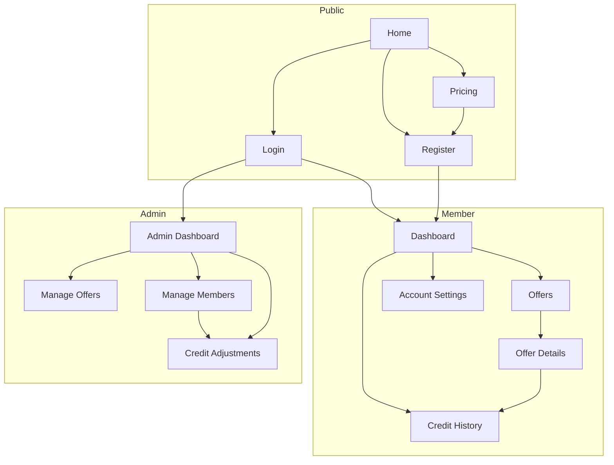

# Huntington Select — MVP Pages

This document defines the **minimum set of pages** for the Huntington Select MVP: what each screen is for, what it shows, what data it needs, and what users can do there. It is a planning guide only (no application code).

For system-wide context, see [project-architecture.md](./project-architecture.md). For table and column names, see [mvp-database-plan.md](./mvp-database-plan.md).

---

## Conventions

| Audience | Access |
|----------|--------|
| **Public** | Anyone; no login required |
| **Member** | Signed-in user with `profiles.role = 'member'` or `admin` |
| **Admin** | Signed-in user with `profiles.role = 'admin'` |

Example routes are suggestions; exact URLs can change during implementation. Auth uses **Supabase Auth**; app data uses the MVP tables: `profiles`, `offers`, `credit_balances`, `credit_ledger`, `redemptions`.

---

## Public pages

### Home

**Example route:** `/`

#### Purpose

Introduce Huntington Select: what the program is, how credits and offers work, and why someone should join. Primary goal is to move visitors toward **Pricing** or **Register**.

#### Main components

- Site header with logo, navigation (Pricing, Login, Register), and mobile menu
- Hero section with headline, short value proposition, and primary call-to-action buttons
- Brief “how it works” steps (join → get credits → redeem offers)
- Optional teaser of offer categories or sample benefits (static or read-only marketing copy; no member catalog required on home)
- Footer with links (Pricing, Login, legal links when added)

#### Data required

- None from the database for MVP (marketing content can be static in the page)
- Optional: count of active offers for social proof (query `offers` where `status = 'active'`) — only if desired later

#### Actions available

- Navigate to **Pricing**
- Navigate to **Register** or **Login**
- Scroll / read marketing content only

---

### Pricing

**Example route:** `/pricing`

#### Purpose

Explain membership and **credit purchase** options clearly, set expectations on cost, and start checkout via **Stripe Checkout** (handled on the server; user returns to success/cancel URLs after payment — see [project-architecture.md](./project-architecture.md)).

#### Main components

- Header (same as public site)
- Plan or credit-pack cards (name, price, credits included, short description)
- FAQ or notes (credits do not expire for MVP, how redemption works, etc.)
- Primary button per option: “Get started” / “Buy credits” (members may land here logged in; visitors may need to register first — product choice at implementation)
- Footer

#### Data required

- **Static pricing configuration** for MVP (prices and credit amounts defined in code or env — no `purchases` table required for first version per [mvp-database-plan.md](./mvp-database-plan.md))
- If user is logged in: current session from Supabase Auth; optional `profiles` row and `credit_balances.balance` to show “You have X credits”

#### Actions available

- Start **Stripe Checkout** for a selected plan or pack (server creates session; redirect to Stripe)
- Navigate to **Register** or **Login** if checkout requires an account
- Return from Stripe via `/checkout/success` or `/checkout/cancel` (companion flows, not separate MVP page entries here)

---

### Login

**Example route:** `/login`

#### Purpose

Let existing users sign in with **Supabase Auth** so they can reach member pages (dashboard, offers, history).

#### Main components

- Header (minimal) or centered auth layout
- Email and password fields (or magic link — choose one approach at implementation)
- Submit button and inline error messages
- Link to **Register** and optional “Forgot password” (Supabase reset flow)
- Redirect message when user was sent here from a protected page

#### Data required

- None before submit
- On success: Supabase session; load `profiles` (at least `role`, `email`) to choose member vs admin destination

#### Actions available

- Sign in (Supabase Auth)
- Navigate to **Register**
- Request password reset (if email/password auth is used)
- After login: redirect to **Dashboard** (or admin home if `role = 'admin'`)

---

### Register

**Example route:** `/register` (also referred to as sign-up in [project-architecture.md](./project-architecture.md))

#### Purpose

Create a new account, establish a **profile** and initial **credit balance**, and optionally send a **welcome email** (Resend, server-only).

#### Main components

- Header (minimal) or centered auth layout
- Registration form: email, password (and confirm password), optional display name if added to `profiles` later
- Terms acceptance checkbox if legal pages exist
- Submit button and validation errors
- Link to **Login**

#### Data required

- On successful sign-up: create or ensure `profiles` row (`id`, `email`, `role` default `member`, `created_at`)
- Initialize `credit_balances` with `balance = 0` (trigger or server logic)
- Supabase Auth user record

#### Actions available

- Create account (Supabase Auth + profile/balance setup)
- Navigate to **Login**
- After registration: redirect to **Dashboard** or **Pricing** depending on product flow

---

## Member pages

All member pages require a signed-in user. **RLS** ensures members only read their own balance, ledger, and redemptions; offers are readable according to policy (typically active offers for members).

### Dashboard

**Example route:** `/dashboard`

#### Purpose

Give members a quick home: **current credit balance**, shortcuts to browse offers and buy credits, and a snapshot of recent activity.

#### Main components

- Member app shell: header with nav (Dashboard, Offers, Credit History, Account Settings), balance badge, sign out
- Credit balance card (large, prominent)
- Quick actions: “Browse offers”, “Buy credits” (→ Pricing / Stripe)
- Recent activity list (last few `credit_ledger` entries and/or `redemptions` with offer titles)
- Empty states when no activity yet

#### Data required

- `profiles` for current user (`email`, `role`)
- `credit_balances` for `user_id = current user`
- Recent `credit_ledger` rows (ordered by `created_at`, limited)
- Optional join: recent `redemptions` with `offers.title` for display

#### Actions available

- Navigate to **Offers**, **Credit History**, **Account Settings**, **Pricing**
- Sign out
- No credit-changing actions on dashboard itself (redemption happens on offer detail)

---

### Offers

**Example route:** `/offers`

#### Purpose

Let members browse the catalog of benefits they can redeem with credits, filtered to what is available in MVP (e.g. `status = 'active'`).

#### Main components

- Member app shell
- Page title and optional category filter or tabs (`offers.category`)
- Grid or list of offer cards: title, category, `credits_required`, short excerpt of description
- Empty state when no active offers
- Each card links to **Offer Details**

#### Data required

- `offers` where `status = 'active'` (fields: `id`, `title`, `description`, `category`, `credits_required`, `created_at`)
- Current user’s `credit_balances.balance` (optional on each card: “You can afford this” vs not)

#### Actions available

- Filter or sort by category (optional MVP)
- Open **Offer Details** for an offer
- Navigate elsewhere via app shell

---

### Offer Details

**Example route:** `/offers/[id]`

#### Purpose

Show full offer information and let the member **redeem** credits in one trusted server action (debit balance, write ledger, create redemption, send confirmation email).

#### Main components

- Member app shell
- Offer header: title, category, credit cost
- Full description
- Balance reminder (“You have X credits”)
- Redeem button with confirmation step (modal or inline confirm)
- Success or error feedback (insufficient credits, offer not active, etc.)
- Back link to **Offers**

#### Data required

- Single `offers` row by `id` (`title`, `description`, `category`, `credits_required`, `status`)
- `credit_balances.balance` for current user
- After redeem: new `redemptions` row and matching `credit_ledger` entry (server-side transaction)

#### Actions available

- Confirm **redeem offer** (server only: validate active offer, sufficient balance, insert `redemptions`, negative `credit_ledger` with `type = 'redemption'`, update `credit_balances`)
- Navigate back to **Offers**
- Navigate to **Credit History** after success (optional)

---

### Credit History

**Example route:** `/account/history` or `/credit-history`

#### Purpose

Show a trustworthy timeline of **all credit movements** and redemptions so members can review purchases, spends, and admin adjustments.

#### Main components

- Member app shell
- Combined chronological list or two sections:
  - **Ledger entries**: date, `amount`, `type`, `description`
  - **Redemptions**: date, offer title, `credits_used`
- Running balance optional (can be derived from ledger order)
- Pagination or “load more” for long histories
- Empty state for new members

#### Data required

- `credit_ledger` for current user (`amount`, `type`, `description`, `created_at`)
- `redemptions` for current user with joined `offers.title` (`credits_used`, `created_at`)
- Optional: current `credit_balances.balance` at top of page

#### Actions available

- View-only (no edits)
- Navigate to related **Offer Details** from redemption rows (optional)
- Export or print — out of scope for MVP unless requested

---

### Account Settings

**Example route:** `/account`

#### Purpose

Let members view and update basic account information and sign out securely. Email preference toggles can be stubbed until Resend lists exist.

#### Main components

- Member app shell
- Profile section: email (read-only if tied to auth), member since (`profiles.created_at`)
- Change password form (Supabase Auth) if using passwords
- Optional: notification preferences (placeholder for MVP)
- Danger zone: sign out
- Link to **Credit History**

#### Data required

- `profiles` for current user (`email`, `created_at`, `role`)
- Supabase Auth session metadata as needed for password updates

#### Actions available

- Update password (Supabase)
- Sign out
- Navigate to **Credit History**, **Dashboard**

---

## Admin pages

Admin pages require `profiles.role = 'admin'`. Sensitive writes (offers, credit adjustments) should run through **server-only** routes or Server Actions, not the browser alone, with RLS or service-role access as designed in migrations.

### Admin Dashboard

**Example route:** `/admin`

#### Purpose

Give staff a single overview: how many members, how many active offers, recent redemptions, and quick links to admin tools.

#### Main components

- Admin app shell: nav (Admin Dashboard, Manage Offers, Manage Members, Credit Adjustments), link to member **Dashboard**
- Stat cards: total members, active offers count, redemptions in last 7/30 days (simple counts)
- Table or list of latest redemptions (member email, offer title, credits, date)
- Optional: total credits outstanding (sum of `credit_balances.balance`)

#### Data required

- Aggregate counts on `profiles`, `offers` (by `status`), `redemptions` (with date filter)
- Recent `redemptions` joined with `profiles.email` and `offers.title`
- Optional: sum of `credit_balances.balance`

#### Actions available

- Navigate to **Manage Offers**, **Manage Members**, **Credit Adjustments**
- Drill into a member or offer from list rows (optional links)
- No destructive actions on overview itself

---

### Manage Offers

**Example route:** `/admin/offers`

#### Purpose

Create, edit, and publish offers that members see on **Offers** and **Offer Details**. Control `status` (`draft`, `active`, `archived`) and catalog fields.

#### Main components

- Admin app shell
- Offers table: title, category, `credits_required`, `status`, created date, actions
- “Create offer” button → form page or modal
- Offer form: title, description, category, credits required, status
- Validation messages (positive credits, required title)

#### Data required

- Full list of `offers` for admin (all statuses)
- Single offer row when editing

#### Actions available

- **Create** new offer (insert into `offers`)
- **Update** existing offer (title, description, category, `credits_required`, `status`)
- **Publish** / **unpublish** (set `status` to `active` or `draft` / `archived`)
- Navigate to preview as member (**Offer Details**) in new tab optional
- Delete or archive — prefer **archived** status for MVP instead of hard delete if redemptions exist

---

### Manage Members

**Example route:** `/admin/members`

#### Purpose

Let admins find members, see role and credit balance, and open a member for support (view history, jump to credit adjustment).

#### Main components

- Admin app shell
- Search or filter by email
- Members table: email, `role`, `credit_balances.balance`, `profiles.created_at`
- Member detail drawer or page: recent `credit_ledger` and `redemptions` summary
- Link to **Credit Adjustments** pre-filled with selected member

#### Data required

- `profiles` (all members and admins for MVP, or members only with filter)
- Joined `credit_balances` per user
- Optional on detail: last N `credit_ledger` and `redemptions` for selected `user_id`

#### Actions available

- Search / sort members
- View member detail (read-only history snippet)
- Navigate to **Credit Adjustments** for a chosen member
- Change `role` to `admin` — only if explicitly needed for MVP; otherwise out of scope or super-admin only

---

### Credit Adjustments

**Example route:** `/admin/credits` or `/admin/adjustments`

#### Purpose

Allow trusted staff to **add or remove credits** with a recorded reason (support, goodwill, correction). Every change must append **`credit_ledger`** and update **`credit_balances`** together.

#### Main components

- Admin app shell
- Member selector (email search or dropdown from **Manage Members**)
- Current balance display for selected member
- Form: adjustment amount (positive or negative), required description/note
- Confirmation step for negative adjustments
- Recent admin adjustments list (`credit_ledger` where `type = 'admin_adjustment'`)

#### Data required

- Selected `profiles` + `credit_balances`
- On submit: new `credit_ledger` row (`amount`, `type = 'admin_adjustment'`, `description`, `created_at`)
- Updated `credit_balances.balance` (must not go below zero)

#### Actions available

- Select member
- Submit **credit adjustment** (server transaction: ledger + balance)
- View history of admin adjustments (audit)

---

## Page map (MVP)

---

## Related flows (not separate page entries)

These support the pages above and are described in [project-architecture.md](./project-architecture.md):

| Flow | Role |
|------|------|
| Stripe Checkout return (`/checkout/success`, `/checkout/cancel`) | Member after **Pricing** |
| Stripe webhook (`/api/webhooks/stripe`) | Server: grant credits, `credit_ledger` type `purchase` |
| Resend emails | Welcome (**Register**), purchase, redemption (**Offer Details**) |
| Legal pages (`/privacy`, `/terms`) | Optional public trust pages |

---

## Implementation notes

- Use **Server Components** by default; Client Components only for forms, modals, and interactive filters ([project rules](../.cursor/rules/project-rules.mdc)).
- Never grant or spend credits from the browser alone; redemption and adjustments run on the server.
- Keep navigation consistent: public header vs member shell vs admin shell so users always know where they are.

This document does not change code or database schema; it is the page-level map for building the Next.js App Router routes under `app/`.
