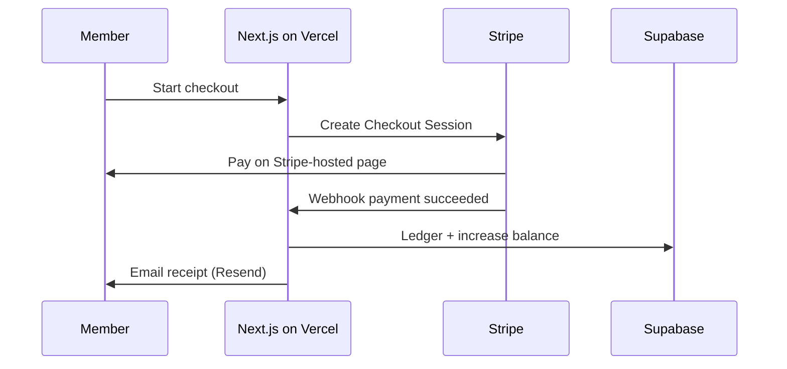
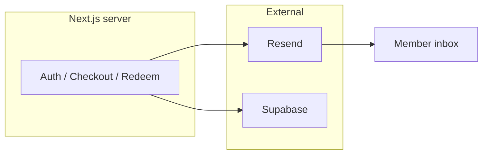
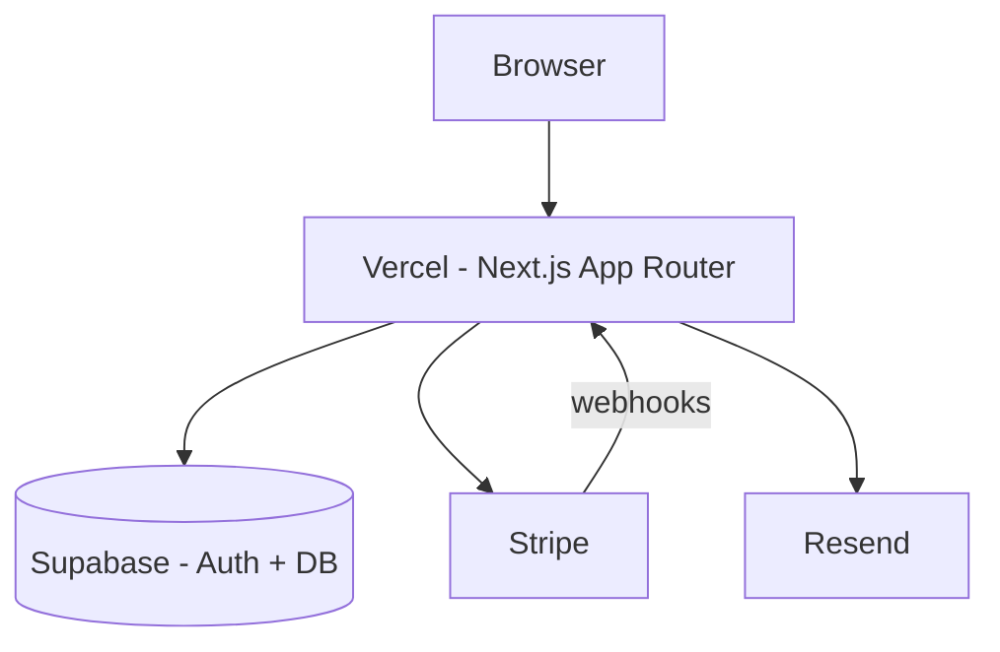

# Huntington Select — Project Architecture (MVP Plan)

This document is a **high-level plan** for how Huntington Select fits together. It is meant for planning and discussion before we wire up Supabase, Stripe, and Resend in code.

---

## 1. Project purpose

**Huntington Select** is a members-only web app where people join a curated program and use **credits** to access offers (for example: dining, events, services, or other partner benefits).

Goals for the MVP:

- Let visitors learn what the program is and sign up or log in.
- Let **members** see their balance, browse available offers, and redeem credits.
- Let **admins** manage offers and see who redeemed what.
- Take **payments** safely (membership and/or credit packs) through Stripe.
- Send important **emails** (welcome, receipts, redemption confirmations) through Resend.
- Store data and auth in **Supabase**, with the website hosted on **Vercel**.

The app is built with **Next.js App Router** (TypeScript + Tailwind CSS): pages live under `app/`, server-side logic runs on the server by default, and interactive pieces use small Client Components only where needed.

---

## 2. Core user roles

| Role | Who they are | What they can do (MVP) |
|------|----------------|-------------------------|
| **Visitor** | Not logged in | View marketing/home, pricing, sign up, log in |
| **Member** | Logged-in paying or invited user | View dashboard, buy or receive credits, browse offers, redeem credits, view history |
| **Admin** | Staff / owner | Everything a member can do, plus create/edit offers, adjust credits (if needed), view redemptions and basic reports |

**How roles are enforced**

- **Supabase Auth** identifies the user (email/password or magic link — decide during implementation).
- A **`profiles`** row (or similar) stores `role`: `member` or `admin`.
- **Row Level Security (RLS)** in Supabase ensures members only see their own credits and redemptions; admins use elevated policies or server-only admin routes.

---

## 3. MVP pages

Routes are examples; exact URLs can change, but this is the minimum useful set.

| Page | Route (example) | Who | Purpose |
|------|-----------------|-----|---------|
| Home / marketing | `/` | Visitor | Explain the program, call to action to join |
| Pricing / join | `/pricing` | Visitor | Plans, credit packs, link to Stripe Checkout |
| Sign up | `/signup` | Visitor | Create account (Supabase) |
| Log in | `/login` | Visitor | Sign in |
| Member dashboard | `/dashboard` | Member | Credit balance, quick links, recent activity |
| Offers catalog | `/offers` | Member | List available offers and credit cost |
| Offer detail | `/offers/[id]` | Member | Description, redeem button |
| Redemption history | `/account/history` | Member | Past redemptions and purchases |
| Account settings | `/account` | Member | Profile, email preferences |
| Admin — offers | `/admin/offers` | Admin | Create, edit, publish/unpublish offers |
| Admin — overview | `/admin` | Admin | Simple stats: members, redemptions, revenue hooks |
| Checkout success / cancel | `/checkout/success`, `/checkout/cancel` | Member | Return URLs after Stripe Checkout |
| Legal (optional MVP) | `/privacy`, `/terms` | Visitor | Trust and compliance basics |

**API / server routes (not “pages” but part of the app)**

- Stripe **webhook** endpoint (e.g. `/api/webhooks/stripe`) — records successful payments and adds credits (server-only, verifies Stripe signature).
- Optional: **Resend** triggered from server actions or API routes after key events (never expose API keys in the browser).

---

## 4. MVP database tables

All tables live in **Supabase (PostgreSQL)**. Names can be tweaked; relationships matter more than exact spelling.

### `profiles`

Extends Supabase `auth.users`.

- `id` (uuid, PK, matches `auth.users.id`)
- `email`, `full_name`
- `role` (`member` | `admin`)
- `created_at`, `updated_at`

### `credit_balances`

One row per member (simple MVP).

- `user_id` (uuid, PK, FK → `profiles.id`)
- `balance` (integer, ≥ 0)
- `updated_at`

### `credit_ledger`

Append-only history of every credit change (audit trail).

- `id` (uuid, PK)
- `user_id` (FK → `profiles.id`)
- `amount` (integer; positive = add, negative = spend)
- `reason` (e.g. `stripe_purchase`, `redemption`, `admin_adjustment`)
- `reference_id` (optional: Stripe session id, redemption id, etc.)
- `created_at`

### `offers`

Things members can redeem.

- `id` (uuid, PK)
- `title`, `description`
- `credit_cost` (integer)
- `is_active` (boolean)
- `starts_at`, `ends_at` (optional)
- `created_at`, `updated_at`

### `redemptions`

When a member spends credits on an offer.

- `id` (uuid, PK)
- `user_id` (FK → `profiles.id`)
- `offer_id` (FK → `offers.id`)
- `credits_spent` (integer)
- `status` (e.g. `confirmed`, `cancelled`)
- `created_at`

### `stripe_customers` (optional but helpful)

Maps app user to Stripe.

- `user_id` (uuid, PK)
- `stripe_customer_id` (text, unique)

### `purchases` (optional MVP)

Record of Stripe checkouts for support and emails.

- `id` (uuid, PK)
- `user_id`
- `stripe_checkout_session_id` or `payment_intent_id`
- `credits_granted` (integer)
- `amount_cents`, `currency`
- `status`
- `created_at`

**RLS:** Members read/update only their own rows where appropriate; offers are readable by all authenticated members; writes to offers and admin adjustments are admin-only.

---

## 5. Credit system overview

Credits are the **internal currency** members use to redeem offers. Money flows through Stripe; credits flow inside Supabase.

### Rules (MVP)

1. **Balance** is stored in `credit_balances.balance`.
2. Every change also writes a row to **`credit_ledger`** (never only update balance in silence).
3. **Adding credits** happens when:
   - Stripe payment succeeds (webhook), or
   - An admin grants credits (ledger reason `admin_adjustment`).
4. **Spending credits** happens when:
   - A member redeems an offer (check balance ≥ cost, then debit + create `redemptions` in one logical transaction).

### Typical flow: buy credits

### Typical flow: redeem an offer

1. Member opens offer detail and confirms redemption.
2. Server checks: offer active, sufficient balance.
3. Server: insert `redemptions`, insert negative `credit_ledger` entry, update `credit_balances`.
4. Server: send confirmation email via Resend.

**Important:** Credit changes that depend on payment must happen in the **Stripe webhook** (or other trusted server code), not in the browser.

---

## 6. Email system overview

**Resend** sends transactional email. The Next.js app calls Resend from **server-only** code using an API key stored in Vercel environment variables.

### MVP email types

| Email | When | Main content |
|-------|------|----------------|
| Welcome | After sign-up | Login link, how credits work |
| Purchase confirmation | Stripe webhook success | Credits added, amount paid |
| Redemption confirmation | After successful redeem | Offer name, credits spent, remaining balance |
| Password / magic link | Supabase Auth | Handled by Supabase templates or custom via Resend if configured later |

### Design principles

- Use a single **from** address (e.g. `hello@yourdomain.com`) verified in Resend.
- Keep templates simple (HTML or Resend React Email later).
- Do not send secrets or full payment card data in email.
- Log failures server-side; retry or alert for webhook + email failures.

---

## 7. Deployment overview

### Environments

| Environment | Purpose |
|-------------|---------|
| **Local** | `npm run dev` on your machine; uses `.env.local` for keys (never commit this file) |
| **Preview** | Vercel deploys each branch/PR; good for testing |
| **Production** | Main branch on Vercel; real Stripe live mode only when ready |

### Where each service runs

| Service | Role |
|---------|------|
| **Vercel** | Hosts the Next.js app, Server Actions, and API routes (including Stripe webhooks) |
| **Supabase** | Database, Auth, RLS; optional Storage for images later |
| **Stripe** | Checkout, Customer records, webhooks for payment events |
| **Resend** | Outbound email API |

### Environment variables (conceptual)

Store these in Vercel (and locally in `.env.local`):

- `NEXT_PUBLIC_SUPABASE_URL`, `NEXT_PUBLIC_SUPABASE_ANON_KEY` (safe for browser with RLS)
- `SUPABASE_SERVICE_ROLE_KEY` (server only — never expose to client)
- `STRIPE_SECRET_KEY`, `STRIPE_WEBHOOK_SECRET`, `NEXT_PUBLIC_STRIPE_PUBLISHABLE_KEY`
- `RESEND_API_KEY`

### Deployment flow

1. Push code to GitHub (or connect repo to Vercel).
2. Vercel builds with `next build` and deploys.
3. Point Stripe webhook URL to production: `https://your-domain.com/api/webhooks/stripe`.
4. Configure Supabase redirect URLs for auth to match Vercel domains (localhost + production).
5. Verify Resend domain for production sending.

### Security checklist (MVP)

- All payment and credit logic on the **server**.
- Supabase **RLS** enabled on every table.
- Stripe webhook **signature verification** required.
- No secret keys in Client Components or `NEXT_PUBLIC_*` variables except Supabase anon key and Stripe publishable key.

---

## How the pieces fit together

---

## Next steps (when you are ready to build)

This repo is still a starter Next.js app. Implementation order that usually works well:

1. Supabase project, tables, RLS, and auth (login/signup pages).
2. Member dashboard and read-only offers.
3. Credit ledger + redemption flow.
4. Stripe Checkout + webhook to grant credits.
5. Resend emails on purchase and redemption.
6. Admin pages for offers.
7. Production hardening on Vercel (env vars, domains, webhooks).

No application code is changed by this document alone; it is the map we will follow as features are added.
