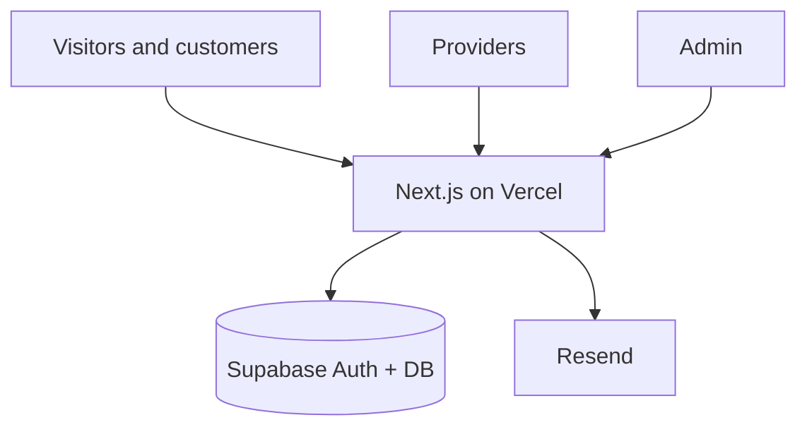

# Huntington Select — Provider Network Pivot Plan

This document records the **corrected product direction** for Huntington Select. It supersedes the credits-and-offers membership model described in [project-architecture.md](./project-architecture.md), [mvp-pages.md](./mvp-pages.md), and [mvp-database-plan.md](./mvp-database-plan.md) for **new work only**. Those files are unchanged historical plans; use **this document** when deciding what to build next.

**Planning only:** no application code, migrations, or other docs are modified by this file.

---

## 1. Updated project purpose

**Huntington Select** is a **curated local service provider network** for Huntington, NY (and nearby areas as you expand). The product helps homeowners and residents find **trusted contractors and service providers** that have been reviewed and approved for the directory—not a generic open marketplace.

### What the product does (MVP vision)

- **Customers** browse a public directory of vetted providers by trade or category, read profiles, and contact providers through clear calls to action (phone, email, website, or a simple inquiry form later).
- **Providers** learn how to join, submit an application with business details, and (once approved) manage a basic listing tied to their account.
- **Admins** review applications, approve or reject providers, publish listings, and keep the directory accurate.

### Goals for the MVP

- Clear **marketing** that explains trust, curation, and local focus.
- A **searchable/browsable directory** of approved providers (no credit redemption).
- A **provider application and onboarding** path with admin review.
- **Auth and roles** so customers, providers, and admins see the right pages.
- **Supabase** for data and auth; **Next.js on Vercel** for the site.
- **Resend** for transactional email (application received, approved, rejected, welcome)—when those flows are built.
- **Stripe** is **not** required for the first directory MVP unless you later add paid listings or membership; do not block launch on payments.

### What we are not building (for this direction)

- Internal **credits** as currency.
- **Offer catalogs** and **redemption** flows.
- Member dashboards centered on credit balance and purchase history.
- Stripe Checkout for credit packs as the primary business model.

The stack in [.cursor/rules/project-rules.mdc](../.cursor/rules/project-rules.mdc) (Next.js, TypeScript, Tailwind, Supabase, Vercel) still applies. Stripe and Resend remain available when a later phase needs them.

---

## 2. Updated user roles

| Role | Who they are | What they can do (MVP) |
|------|----------------|-------------------------|
| **Visitor** | Not logged in | View home, directory, provider public profiles, “Join as a provider” info, login/register |
| **Customer** | Logged-in resident/homeowner (optional for browsing; useful for saved favorites or inquiries later) | Browse directory (same as visitor), account settings; MVP may treat customers like light members without provider powers |
| **Provider** | Approved business with a linked account | View provider dashboard, edit own listing (within rules), see application status if not yet approved |
| **Admin** | Huntington Select staff/owner | Review applications, create/edit any listing, feature providers, manage categories, basic stats |

### How roles are enforced (recommended)

- **Supabase Auth** for sign-in (email/password or magic link—choose at implementation).
- **`profiles`** (or equivalent) stores `role`: `customer`, `provider`, or `admin`.
- A **`providers`** (or `provider_profiles`) row links a `profiles.id` to the public directory entry once approved.
- **Row Level Security (RLS):** providers update only their own listing; customers see only their own inquiry/save data if those tables exist; directory reads for **published** listings are public or authenticated as designed; admin writes via elevated policies or server-only routes.

**Note:** Existing migrations use `profiles.role` of `member` | `admin`. Adopting this pivot will eventually require a **new migration** (out of scope here) to extend roles and add provider tables—plan that in a later phase, not by editing old migration files.

---

## 3. MVP public pages

Anyone can view these without logging in. Routes are examples.

| Page | Example route | Purpose |
|------|---------------|---------|
| Home | `/` | Explain curated local network, trust, categories; CTAs to **Directory** and **Join as a provider** |
| Directory | `/providers` or `/directory` | List/grid of approved providers; filter by category, search by name or keyword |
| Provider public profile | `/providers/[slug]` or `/providers/[id]` | Business name, services, service area, description, contact, optional photo/logo |
| Join as a provider | `/for-providers` | Why join, requirements, link to **Register** / **Apply** |
| Login | `/login` | Sign in; redirect by role (customer → account, provider → provider dashboard, admin → admin) |
| Register | `/register` | Create account; choose or default role (customer vs provider applicant—product decision at build time) |
| About / how it works (optional) | `/about` | Curation process, what “Select” means |
| Legal (optional) | `/privacy`, `/terms` | Trust and compliance |

### Public page principles

- Directory and profile pages should work on **mobile** and load fast (Server Components, minimal client JS).
- Only **approved, published** listings appear in the directory.
- No credit balance, pricing packs, or offer cards on the public site.

---

## 4. MVP provider pages

Require sign-in as a user who is a **provider applicant** or **approved provider** (exact gating depends on application state).

| Page | Example route | Purpose |
|------|---------------|---------|
| Provider dashboard | `/provider` or `/provider/dashboard` | Status: draft application, pending review, approved; link to edit listing |
| Application | `/provider/apply` | Submit or update application (business name, trades, license info if collected, contact, service area, description) |
| Edit listing | `/provider/listing` | Edit fields admins allow providers to change (description, phone, website, hours—keep scope small for MVP) |
| Account settings | `/provider/account` or shared `/account` | Email, password, sign out |

### Provider flows (MVP)

1. Register → complete **application** → status **pending**.
2. Admin **approves** → listing **published** → appears in directory.
3. Provider maintains listing via **edit listing**; major changes can stay admin-only until later.

**Emails (when Resend is wired):** application received, approved, rejected (with optional reason).

---

## 5. MVP admin pages

Require `profiles.role = 'admin'`.

| Page | Example route | Purpose |
|------|---------------|---------|
| Admin overview | `/admin` | Counts: pending applications, published providers, categories; recent activity |
| Review applications | `/admin/applications` | Queue of pending submissions; approve, reject, request changes |
| Manage providers | `/admin/providers` | Table of all providers; edit, publish/unpublish, feature |
| Manage categories | `/admin/categories` | Trades/service categories used in directory filters |
| Provider editor | `/admin/providers/[id]` | Full edit of listing and internal notes (optional) |

Sensitive actions (approve, publish, delete) run on the **server** only, with RLS or service-role access as appropriate.

---

## 6. Recommended database tables

These tables describe the **target schema** for the provider network. They replace the credits/offers/redemptions model for new features. Implement via **new** Supabase migrations in a future phase; do not rewrite `001_initial_schema.sql` or `002_offer_schema_v2.sql`.

### `profiles` (evolve)

- `id` (uuid, PK, matches `auth.users.id`)
- `email`, `full_name` (optional)
- `role` (`customer` | `provider` | `admin`) — migration from legacy `member` when ready
- `created_at`, `updated_at`

### `service_categories`

- `id` (uuid, PK)
- `name` (e.g. Plumbing, Electrical, Landscaping)
- `slug` (unique, for URLs/filters)
- `sort_order` (integer)
- `is_active` (boolean)

### `provider_applications`

Captures intake before approval (can merge into `providers` later if you prefer one table; separate table keeps pending data clean).

- `id` (uuid, PK)
- `user_id` (FK → `profiles.id`)
- `business_name`, `contact_name`, `phone`, `email`, `website` (optional)
- `service_area` (text or structured later)
- `description` (text)
- `status` (`draft` | `submitted` | `approved` | `rejected`)
- `admin_notes` (text, admin only)
- `submitted_at`, `reviewed_at`, `created_at`, `updated_at`

### `providers` (directory listings)

One row per approved business (linked to the account that owns it).

- `id` (uuid, PK)
- `user_id` (FK → `profiles.id`, unique where one business per account for MVP)
- `application_id` (FK → `provider_applications.id`, optional)
- `slug` (unique, for public URLs)
- `business_name`, `short_tagline`, `description`
- `phone`, `email`, `website`
- `service_area`, `address_display` (optional; be careful with PII)
- `logo_url` or `image_url` (optional; Supabase Storage later)
- `status` (`draft` | `published` | `suspended` | `archived`)
- `featured` (boolean)
- `published_at`, `created_at`, `updated_at`

### `provider_categories` (join)

- `provider_id` (FK → `providers.id`)
- `category_id` (FK → `service_categories.id`)
- Primary key on `(provider_id, category_id)`

### Optional later (not required for first directory MVP)

| Table | Purpose |
|-------|---------|
| `customer_inquiries` | Log contact form submissions to a provider |
| `saved_providers` | Customer bookmarks |
| `provider_documents` | Licenses, insurance uploads for admin review |
| `reviews` | Ratings after you have a moderation policy |

### Tables to deprecate for new product work (keep in DB until migrated)

| Legacy table | Former role |
|--------------|-------------|
| `offers` | Credit redeemable benefits |
| `credit_balances` | Member credit totals |
| `credit_ledger` | Credit audit trail |
| `redemptions` | Offer redemptions |

**RLS (conceptual):** public read on `providers` where `status = 'published'` and join categories; providers read/write own application and listing fields allowed by policy; admin full manage; customers read own profile only unless inquiry tables exist.

---

## 7. What existing offers/credits work should be paused

Stop extending the **membership + credits + offers** product until the pivot schema and pages are in place. Do not delete existing work without a deliberate cleanup phase.

### Product and planning

- Treat [project-architecture.md](./project-architecture.md), [mvp-pages.md](./mvp-pages.md), and [mvp-database-plan.md](./mvp-database-plan.md) as **archive** for the old model when scoping sprints.
- Do not plan **Pricing** pages, **credit packs**, or **Stripe webhooks that grant credits** as part of the next MVP.

### Database and migrations

- **Pause** new migrations that extend `offers` (including fields aimed at merchants/redemption in `002_offer_schema_v2.sql` style).
- **Pause** triggers, RLS tweaks, or seed data focused on redemptions and credit ledger.
- **Do not** apply breaking changes to existing tables until a dedicated migration strategy is written (new tables first, then deprecate).

### Application code (already started in repo)

Pause feature work on:

- **Offers directory and detail** (`app/offers`, `components/offers`, `lib/offers`).
- **Member dashboard** centered on credit balance and recent redemptions (`app/dashboard`, `lib/dashboard`, `components/dashboard/recent-redemptions.tsx`).
- **Member shell navigation** that prioritizes Offers and credit history.
- Any **redemption** server actions, credit checks, or admin offer management not yet built but specified in old MVP docs.

Safe to **keep** (reuse for pivot):

- **Auth pages** (`login`, `register`) with role redirects updated later.
- **Layout**, **Tailwind**, and **Supabase client** setup.
- General patterns: Server Components, server-only data fetching.

### Integrations

- **Stripe:** pause Checkout and webhooks for credit purchases.
- **Resend:** pause emails about purchases, redemptions, and “how credits work”; repurpose templates for provider application lifecycle when ready.

---

## 8. Recommended next build phases

Small, focused phases match [project rules](../.cursor/rules/project-rules.mdc) and avoid rewriting the whole app at once.

### Phase 1 — Foundation and public directory (read-only)

1. Add planning alignment: team uses **this document** as source of truth.
2. New migrations: `service_categories`, `providers`, `provider_categories` (minimal columns), `profiles` role extension—**new files only**.
3. Seed a few categories and sample published providers for design/dev.
4. Build **Home**, **Directory**, **Provider public profile** (static or DB-driven).
5. Admin: manual seed or a minimal **publish** script; full admin UI can wait until Phase 3.

**Outcome:** Visitors can browse a credible Huntington Select directory.

### Phase 2 — Provider application flow

1. Table `provider_applications` + RLS.
2. **For providers** marketing page, **Register** path for applicants, **Apply** form, **provider dashboard** with status.
3. Resend: application received (optional but high value).

**Outcome:** Contractors can apply; listings still require admin approval.

### Phase 3 — Admin review and listing management

1. **Admin** overview, **applications** queue (approve/reject), **manage providers**, **categories**.
2. On approve: create/update `providers`, set `published`, link categories.
3. Resend: approved / rejected emails.

**Outcome:** End-to-end curation without editing the database by hand.

### Phase 4 — Provider self-service and polish

1. **Edit listing** for approved providers (limited fields).
2. Improve search/filters, featured providers on home, mobile nav.
3. Optional: inquiry form + `customer_inquiries` table.

**Outcome:** Providers maintain their presence; customers have a smooth path to contact.

### Phase 5 — Customer account value (optional)

1. Clarify whether customers must log in to browse (recommend: no for MVP).
2. Add **account** page for customers, saved providers, or inquiry history if needed.

### Phase 6 — Monetization and legacy cleanup (later)

1. Decide if Stripe applies (featured placement, annual provider fee, homeowner membership)—only when requested.
2. Migrate or archive `offers`, `credit_balances`, `credit_ledger`, `redemptions` data if any exists in production.
3. Remove or redirect legacy routes (`/offers`, credit-focused `/dashboard`) to the new directory.

---

## How the pivot fits the stack

---

## Related documents

| Document | Status |
|----------|--------|
| [provider-network-pivot-plan.md](./provider-network-pivot-plan.md) | **Current direction** (this file) |
| [project-architecture.md](./project-architecture.md) | Previous credits/offers architecture |
| [mvp-pages.md](./mvp-pages.md) | Previous page map |
| [mvp-database-plan.md](./mvp-database-plan.md) | Previous table plan |

When implementation starts, update task lists and PR descriptions to reference **this pivot plan**, not the credits MVP alone.
